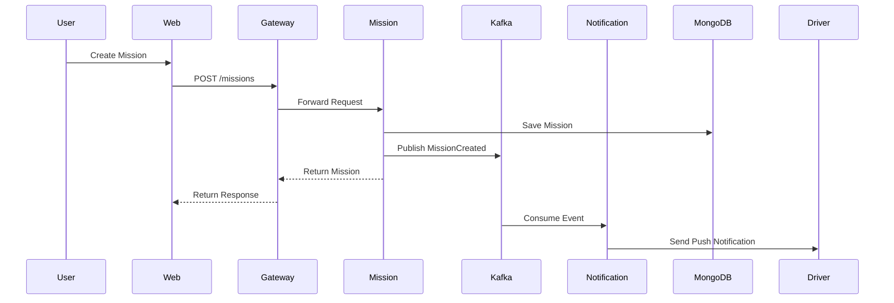
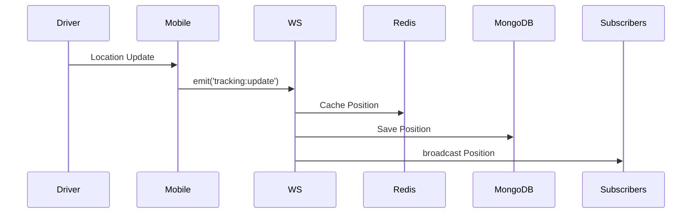

# 🏗️ TMSA Architecture Documentation

## Table of Contents
1. [System Overview](#system-overview)
2. [Architecture Patterns](#architecture-patterns)
3. [Data Flow](#data-flow)
4. [Database Schema](#database-schema)
5. [API Contracts](#api-contracts)
6. [Security Architecture](#security-architecture)
7. [Scalability Strategy](#scalability-strategy)
8. [Disaster Recovery](#disaster-recovery)

---

## System Overview

### High-Level Architecture

```
┌─────────────┐         ┌─────────────┐
│   Web App   │         │ Mobile App  │
│ (Next.js15) │         │(RN Expo 50) │
└──────┬──────┘         └──────┬──────┘
       │                       │
       └───────────┬───────────┘
                   │ HTTPS/WSS
              ┌────▼─────┐
              │   CDN    │
              │CloudFront│
              └────┬─────┘
                   │
              ┌────▼─────┐
              │  API GW  │ ◄── Rate Limiting
              │  :8080   │ ◄── Auth Guard
              └────┬─────┘ ◄── Load Balancer
                   │
    ┌──────────────┼──────────────┐
    │              │              │
┌───▼───┐    ┌────▼─────┐   ┌───▼────┐
│ Auth  │    │ Tracking │   │Payment │
│ :3001 │    │  :3003   │   │ :3004  │
└───┬───┘    └────┬─────┘   └───┬────┘
    │             │              │
    └─────────────┼──────────────┘
                  │
         ┌────────┼────────┐
         │        │        │
    ┌────▼──┐ ┌──▼───┐ ┌──▼───┐
    │MongoDB│ │Redis │ │Kafka │
    └───────┘ └──────┘ └──────┘
```

---

## Architecture Patterns

### 1. Microservices Architecture

**Benefits**:
- Independent deployment
- Technology diversity
- Fault isolation
- Horizontal scalability

**Communication**:
- **Sync**: HTTP/REST (via API Gateway)
- **Async**: Kafka (event streaming)
- **Real-time**: WebSocket (Socket.io)

### 2. Event-Driven Architecture

**Events**:
```typescript
// Example: Mission lifecycle events
MissionCreated -> MissionAssigned -> MissionStarted 
  -> CheckpointReached -> MissionCompleted
```

**Kafka Topics**:
- `mission.lifecycle`
- `tracking.positions`
- `payment.transactions`
- `notification.outbox`

### 3. CQRS (Command Query Responsibility Segregation)

**Write Model** (Commands):
- MongoDB (transactional data)
- Optimized for writes
- Event sourcing

**Read Model** (Queries):
- PostgreSQL (analytics)
- Elasticsearch (search)
- Redis (cache)

---

## Data Flow

### Mission Creation Flow



### GPS Tracking Flow



---

## Database Schema

### MongoDB Collections

#### Users Collection
```typescript
{
  _id: ObjectId,
  email: string,
  phone: string,
  firstName: string,
  lastName: string,
  role: UserRole,
  organizationId: ObjectId,
  passwordHash: string,
  status: UserStatus,
  createdAt: Date,
  updatedAt: Date
}
```

#### Missions Collection
```typescript
{
  _id: ObjectId,
  missionNumber: string,
  organizationId: ObjectId,
  driverId: ObjectId,
  vehicleId: ObjectId,
  status: MissionStatus,
  type: MissionType,
  cargoType: CargoType,
  origin: Location,
  destination: Location,
  checkpoints: Checkpoint[],
  totalCost: number,
  currency: string,
  scheduledStartDate: Date,
  actualStartDate: Date,
  documents: ObjectId[],
  createdAt: Date,
  updatedAt: Date
}
```

#### Tracking Positions Collection
```typescript
{
  _id: ObjectId,
  missionId: ObjectId,
  vehicleId: ObjectId,
  driverId: ObjectId,
  coordinates: {
    latitude: number,
    longitude: number
  },
  speed: number,
  heading: number,
  accuracy: number,
  timestamp: Date,
  batteryLevel: number,
  isMoving: boolean
}
```

### PostgreSQL Tables

#### Analytics Schema
```sql
CREATE TABLE mission_analytics (
  id UUID PRIMARY KEY,
  mission_id VARCHAR(50),
  total_distance_km DECIMAL(10,2),
  total_duration_hours DECIMAL(10,2),
  average_speed_kmh DECIMAL(10,2),
  fuel_consumed_liters DECIMAL(10,2),
  co2_emissions_kg DECIMAL(10,2),
  checkpoint_count INT,
  delay_minutes INT,
  completed_at TIMESTAMP,
  created_at TIMESTAMP DEFAULT NOW()
);

CREATE INDEX idx_mission_analytics_completed 
  ON mission_analytics(completed_at);
```

### Redis Cache Structure

```
# User sessions
user:session:{userId} -> JWT payload (TTL: 15min)

# GPS positions (last known)
tracking:position:{vehicleId} -> Position data (TTL: 5min)

# Mission cache
mission:cache:{missionId} -> Mission data (TTL: 1hour)

# Rate limiting
ratelimit:{userId}:{endpoint} -> Request count (TTL: 1min)
```

---

## API Contracts

### RESTful API Design

**Base URL**: `https://api.tmsa.africa/v1`

**Authentication**: Bearer Token (JWT)

### Example: Create Mission

**Request**:
```http
POST /missions
Authorization: Bearer {token}
Content-Type: application/json

{
  "type": "EXPORT",
  "cargoType": "MINERALS",
  "cargoDescription": "Copper concentrate - 25 tons",
  "weight": 25000,
  "origin": {
    "name": "Lubumbashi Mine",
    "coordinates": { "latitude": -11.6645, "longitude": 27.4794 }
  },
  "destination": {
    "name": "Dar es Salaam Port",
    "coordinates": { "latitude": -6.7924, "longitude": 39.2083 }
  },
  "scheduledStartDate": "2024-02-01T08:00:00Z",
  "totalCost": 5000,
  "currency": "USD"
}
```

**Response**:
```json
{
  "success": true,
  "data": {
    "id": "65a1b2c3d4e5f6g7h8i9j0k1",
    "missionNumber": "MSN-2024-000145",
    "status": "DRAFT",
    "estimatedDistance": 1850,
    "estimatedDuration": 48,
    "createdAt": "2024-01-15T10:30:00Z"
  }
}
```

---

## Security Architecture

### Authentication Flow

```
1. User enters credentials
2. Auth service validates (bcrypt)
3. JWT tokens generated:
   - Access Token (15min)
   - Refresh Token (7 days)
4. Tokens stored:
   - Client: LocalStorage/AsyncStorage
   - Server: Redis (session cache)
5. Each request: Bearer token in header
6. API Gateway validates JWT
```

### Authorization (RBAC)

**Permission Matrix**:

| Resource   | Super Admin | Mine Operator | Broker | Driver |
|------------|-------------|---------------|--------|--------|
| Create Mission | ✅ | ✅ | ✅ | ❌ |
| View Missions | ✅ | ✅ (own) | ✅ (own) | ✅ (assigned) |
| Track GPS | ✅ | ✅ | ✅ | ✅ |
| Process Payment | ✅ | ✅ | ❌ | ❌ |
| View Analytics | ✅ | ✅ (own) | ❌ | ❌ |

### Data Encryption

**At Rest**:
- MongoDB: Encrypted storage engine
- S3: Server-side encryption (AES-256)
- Secrets: AWS Secrets Manager

**In Transit**:
- TLS 1.3 everywhere
- HTTPS only
- WSS for WebSockets

---

## Scalability Strategy

### Horizontal Scaling

**Auto-scaling triggers**:
```yaml
# Kubernetes HPA
- CPU > 70%
- Memory > 80%
- Custom: Request queue depth > 100
```

**Scaling limits**:
- API Gateway: 3-10 pods
- Auth Service: 2-5 pods
- Tracking Service: 3-15 pods (high load)

### Database Scaling

**MongoDB**:
- Replica Set (3 nodes)
- Sharding by `organizationId`
- Read preference: Secondary for reads

**Redis**:
- Cluster mode (6 nodes)
- Read replicas

**PostgreSQL**:
- Multi-AZ deployment
- Read replicas (2x)

### Caching Strategy

```
L1: Browser Cache (static assets)
L2: CDN (CloudFront)
L3: Redis (API responses)
L4: Database query cache
```

**Cache Invalidation**:
- Time-based (TTL)
- Event-based (Kafka triggers)

---

## Disaster Recovery

### Backup Strategy

**Databases**:
- MongoDB: Daily snapshots (30d retention)
- PostgreSQL: Continuous archiving (WAL)
- Redis: RDB snapshots (hourly)

**S3 Documents**:
- Versioning enabled
- Cross-region replication
- Glacier for archives (>1 year)

### High Availability

**Uptime Target**: 99.9% (8.76 hours downtime/year)

**Strategy**:
- Multi-AZ deployment
- Active-Active failover
- Health checks every 10s
- Automatic pod restart

### Incident Response

**Severity Levels**:
- **P0** (Critical): Service down → 15min response
- **P1** (High): Degraded → 1h response
- **P2** (Medium): Minor bug → 4h response
- **P3** (Low): Enhancement → 24h response

**On-Call Rotation**: 24/7 coverage

---

## Performance Optimization

### API Response Times

**Targets**:
- p50: < 100ms
- p95: < 200ms
- p99: < 500ms

**Techniques**:
- Database indexing
- Query optimization
- Response compression (gzip)
- Connection pooling

### WebSocket Performance

**Optimization**:
- Redis adapter for sticky sessions
- Binary protocol (msgpack)
- Heartbeat every 25s
- Backpressure handling

---

## Monitoring & Observability

### Key Metrics

**Golden Signals**:
1. **Latency**: Request duration
2. **Traffic**: Requests/second
3. **Errors**: Error rate %
4. **Saturation**: Resource utilization

### Alerting Rules

```yaml
- alert: HighErrorRate
  expr: rate(http_requests_total{status=~"5.."}[5m]) > 0.05
  for: 5m
  annotations:
    summary: "High error rate detected"

- alert: HighLatency
  expr: http_request_duration_seconds{quantile="0.95"} > 1
  for: 5m
```

---

## Compliance & Regulations

- **GDPR**: User data privacy (EU)
- **PCI-DSS**: Payment card data
- **ISO 27001**: Information security
- **SOC 2**: Security controls

---

**Last Updated**: 2024-01-15
**Version**: 1.0.0
**Maintained by**: TMSA Tech Team
